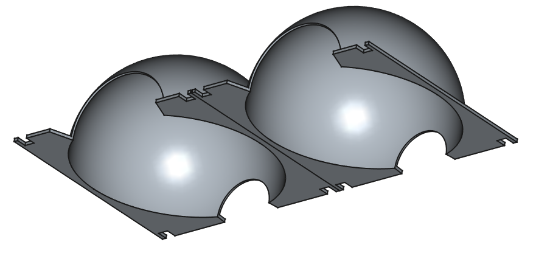

# 🌱 Margotta 3D per Propagazione delle Piante

Progetto 3D per la realizzazione di una **capsula da margotta**, pensata per aiutare giardinieri e appassionati a moltiplicare facilmente le loro piante legnose e rampicanti. Progettata per essere stampata in 3D con facilità, senza supporti, e utilizzabile più volte.

## 🎯 Obiettivo

Facilitare la tecnica della **margotta aerea** con un dispositivo riutilizzabile, modulare e robusto, adatto a piante da interno e da esterno. L’idea nasce per contribuire alla sostenibilità e al giardinaggio rigenerativo domestico.

## 🛠 Specifiche Tecniche

* **Tecnologia**: Stampa FDM
* **Materiale consigliato**: PETG o ASA (per resistenza agli agenti atmosferici)
* **Dimensioni**: \~95mm diametro, 2 metà incernierate + fermo a elastico
* **Tempo di stampa stimato**: \~3h totali
* **Supporti**: ad albero per la cupola
* **Infill consigliato**: 15%
* **File inclusi**:

  * `margotta.stl`

## 🌿 Come si usa

1. Effettua un'incisione leggera sul ramo della pianta che vuoi moltiplicare.
2. Riempi la margotta 3D con torba o muschio umido.
3. Posiziona la margotta attorno al ramo e fissala con due elastici.
4. Aspetta 3-6 settimane finché non si formano le radici.
5. Rimuovi, taglia sotto la margotta e rinvasa il nuovo esemplare.

## 🧠 Idee e Design

Il design prende ispirazione dai metodi tradizionali asiatici di propagazione e dalla necessità di un prodotto:

* **ecologico** (riutilizzabile),
* **funzionale** (aderenza sicura al ramo),
* **facilmente stampabile**.

## 📷 Galleria

## 📦 Licenza

Questo progetto è rilasciato sotto licenza **Creative Commons BY-NC-SA 4.0**. Sentiti libero di migliorarlo e condividerlo per usi non commerciali.
